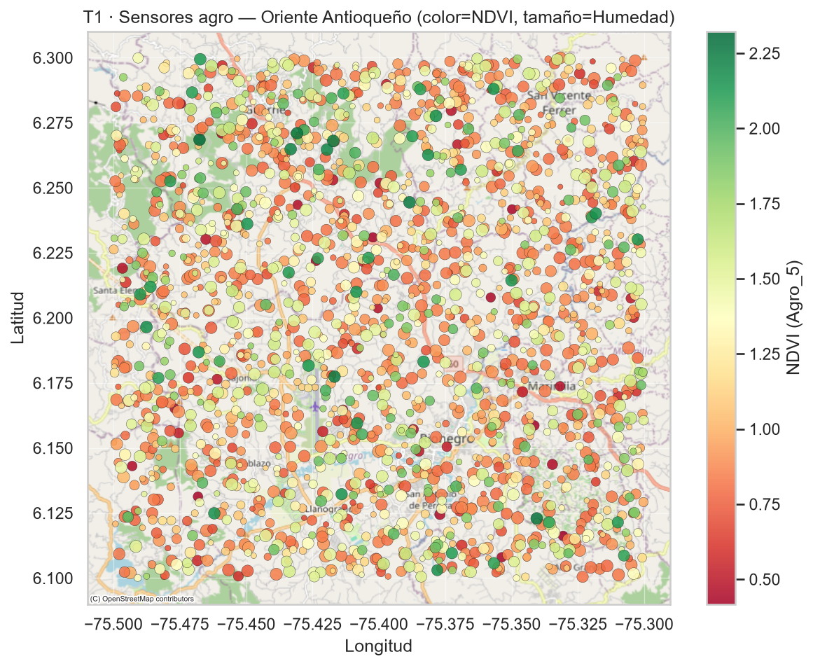
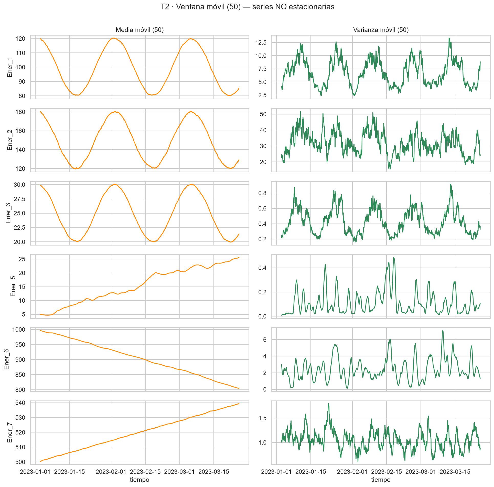
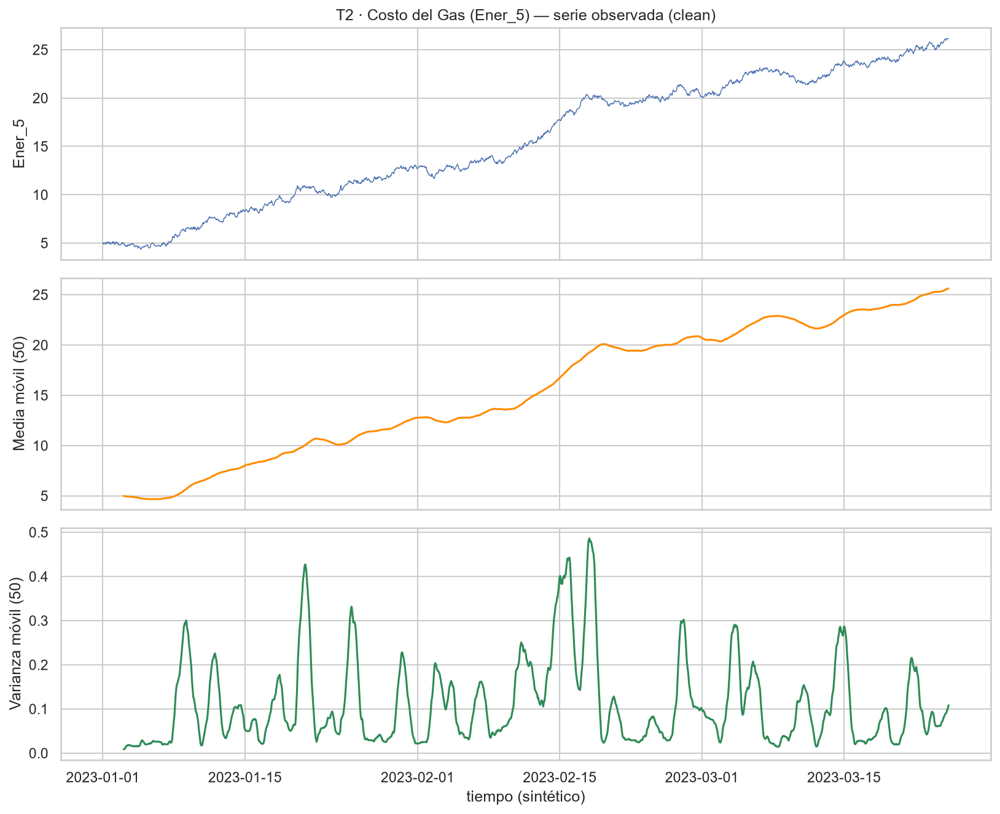
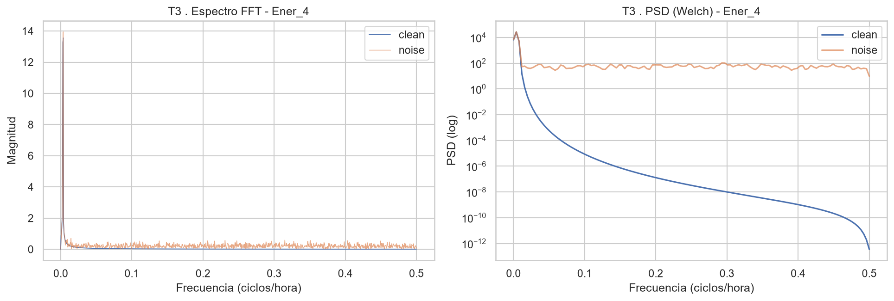
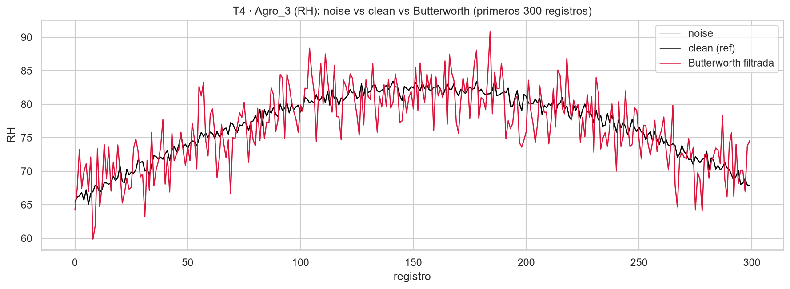
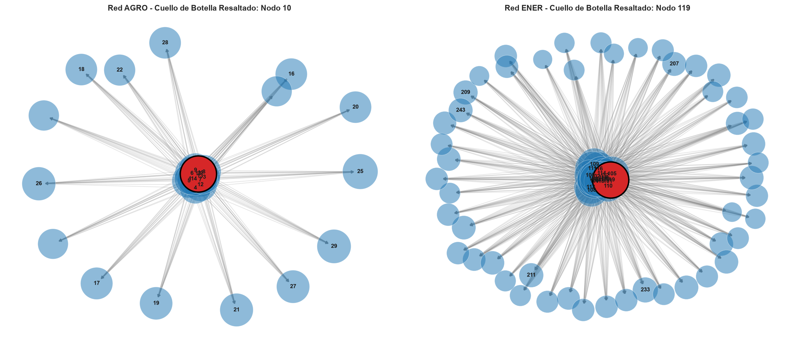
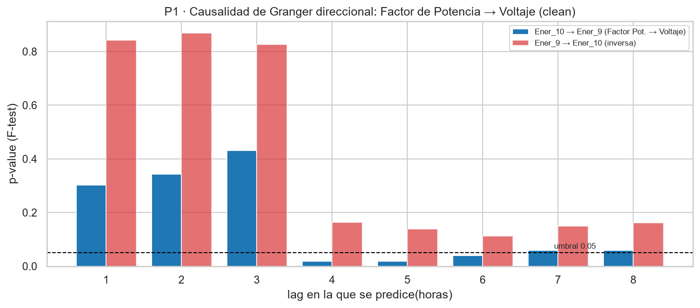
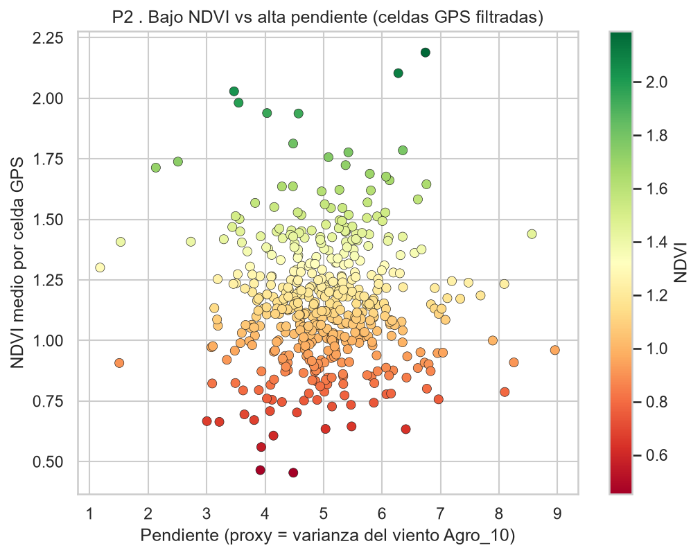
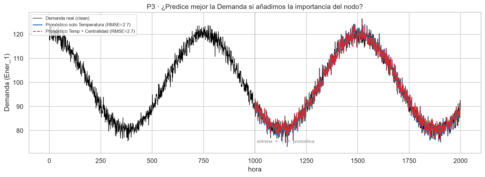
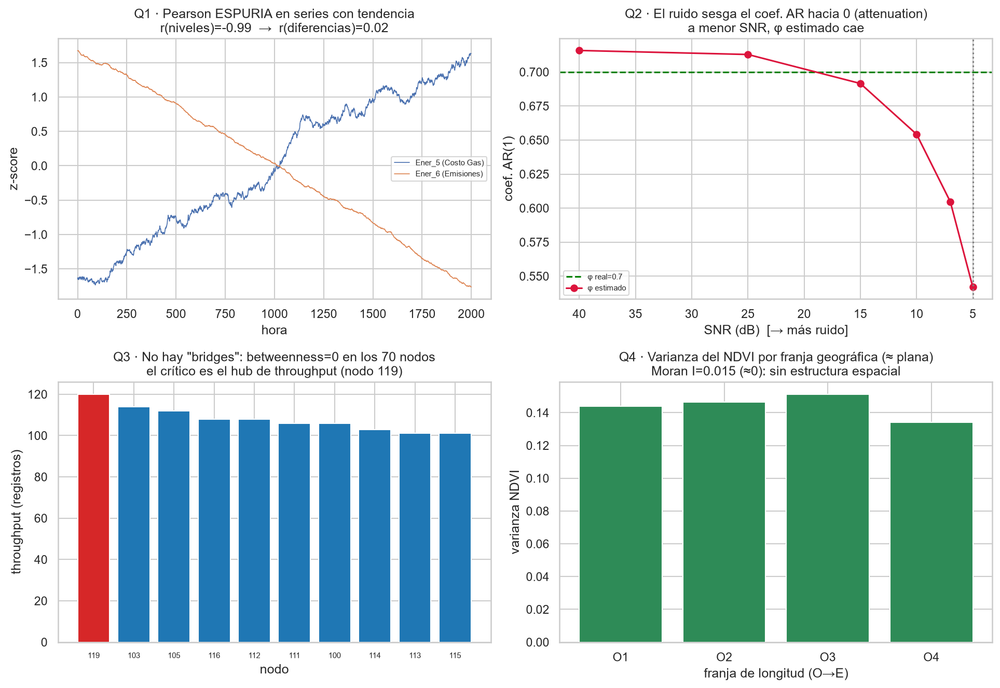

# TechLogistics S.A. — Challenge 03: Analítica Multidimensional

[](https://colab.research.google.com/github/santiagovelcasallas/Challenge03_techlogistics-GomezVelez/blob/main/notebooks/challenge03_analitica_multidimensional.ipynb)

**Curso:** Análisis de Datos Avanzado / Fundamentos en Ciencia de Datos — Maestría en Ciencia de los Datos, EAFIT
**Docente:** Jorge Iván Padilla-Buriticá · **Periodo:** 2026
**Caso:** TechLogistics S.A. (ficticio) — de señales y redes a decisiones operativas.

**Integrantes del equipo:**

| Nombre completo | Cédula |
| --- | --- |
| Santiago Alberto Vélez Casallas | 1072714309 |
| Cristian Miguel Gómez Salazar | 1003402002 |

> **Nota sobre la numeración:** el PDF del docente se titula *"Challenge 02"*, pero corresponde
> al **workshop de la Lecture 03**. Se unifica la etiqueta a **Challenge 03** (el "02" fue un
> error de numeración en el documento fuente).

---

## 1. Resumen ejecutivo

TechLogistics opera dos redes de sensores georreferenciadas pero desconectadas entre sí:
**Agroindustria/Clima** (`agro_*`) y **Energía/Economía** (`ener_*`). La junta necesita saber
**qué proteger, dónde invertir y qué modelar**. Analizamos 2.000 registros por red con
estadística espacial, series de tiempo, procesamiento de señales, grafos y pronóstico fuera de
muestra — siguiendo CRISP-DM y con **honestidad total**: donde los datos no respaldan la
premisa, lo decimos.

**Decisión central.** Proteger el **nodo energético 119** (compensación reactiva + redundancia)
y desplegar intervenciones hídricas **puntuales por sensor**. La evidencia **no** respalda una
intervención territorial "por pendiente" ni incorporar la centralidad del nodo al pronóstico de
demanda.

| Hallazgo | Evidencia | Decisión |
|---|---|---|
| Nodo energético crítico | Nodo 119: 120 registros; **betweenness = 0** en toda la red | Redundancia y compensación reactiva en el nodo 119 |
| Factor de potencia anticipa voltaje | Granger **p = 0,019** (rezago 4 h); dirección inversa p = 0,113 | Alerta temprana sobre el factor de potencia |
| NDVI sin patrón territorial | Moran **I ≈ 0**; Spearman **ρ = 0,010** (p = 0,828) | Intervenir sensores puntuales, **no** "zonas de pendiente" |
| Pronóstico de demanda | RMSE 2,69 vs 2,68 (+0,4 %); Diebold-Mariano **p = 0,44** | Mantener temperatura; **no** añadir centralidad |
| Filtrado de humedad relativa | RMSE 3,341 → 1,307 (**−60,9 %**) | Filtrar antes de modelar y alertar |
| Costo del gas con tendencia | Pendiente 0,011; **R² = 0,978**; p ≈ 0 | Modelar en diferencias y monitorear la tendencia |

> **Advertencia de evidencia.** La "falla del nodo 214" del enunciado **no aparece en los datos**:
> es el `Target` que **menos** flujo recibe (27 registros, rank 50/50), recibe flujo incluso con
> precio > percentil 90, y sus medias de precio/temperatura ≈ las globales. Se trata como **marco
> narrativo**, no como anomalía demostrada.

---

## 2. Preguntas de negocio (P1–P3)

- **P1.** ¿El **factor de potencia** (`Ener_10`) anticipa el **voltaje** (`Ener_9`)? ¿Qué implica
  un fallo en el nodo crítico para la estabilidad de la red?
- **P2.** ¿Debe priorizarse la **inversión hídrica** en zonas de alta pendiente (proxy `Agro_10`)?
- **P3.** ¿La **importancia del nodo** en la red (centralidad) mejora el **pronóstico de demanda**?

---

## 3. Estructura del repositorio

```
Challenge03_techlogistics-GomezVelez/
├── data/                 # CSV (clean + noise) — versionados (pequeños, reproducibilidad)
├── notebooks/
│   └── challenge03_analitica_multidimensional.ipynb   # análisis completo (fuente de verdad)
├── src/                  # funciones reutilizables (io, estacionariedad, señales, grafos, espacial, viz)
├── figures/              # PNG exportados (evidencia del informe)
├── reports/
│   └── Challenge03_informe_tecnico_ejecutivo_techlogistics.pdf   # informe ejecutivo final
├── scripts/
│   └── legacy/           # generadores históricos DESACTIVADOS (no ejecutar) — ver DEPRECATED.md
├── requirements.txt · requirements-lock.txt
├── .gitignore
└── README.md
```

Los CSV se versionan (son pequeños y necesarios para reproducir); el `venv/` se ignora. El
**notebook y el informe PDF son la fuente de verdad** y se editan directamente — los generadores
que existían al inicio (`build_notebook.py`, `build_report.py`) quedaron **desactivados** en
`scripts/legacy/`.

---

## 4. Cómo reproducir

**Google Colab (sin instalar nada):** clic en el botón *Open in Colab* de arriba → *Entorno de
ejecución → Ejecutar todo*. La **primera celda (Bootstrap)** detecta Colab, clona el repositorio
(trae `src/` y `data/`) e instala las dependencias que faltan.

**Local (Python 3.11):**
```bash
py -m venv venv && venv\Scripts\activate      # (source venv/bin/activate en Linux/macOS)
pip install -r requirements.txt               # exacto: requirements-lock.txt
jupyter nbconvert --to notebook --execute --inplace ^
  notebooks/challenge03_analitica_multidimensional.ipynb
```

> **Supuestos declarados:** los archivos `*_clean` existen y se usan como referencia real para
> SNR/RMSE; sin columna de fecha se adopta un `DatetimeIndex` horario sintético desde 2023-01-01;
> semilla NumPy = 42; significancia α = 0,05.

---

## 5. Lo que dicen los datos (evidencia con figuras y tablas)

### 5.1 Geografía (T1): la biomasa baja **no** forma una zona continua



El color es NDVI (verdor/biomasa) y el tamaño, humedad. Los valores bajos aparecen **dispersos**.
La **I de Moran** confirma que la cercanía geográfica no produce NDVI parecido → **aleatoriedad
espacial**:

| Vecinos (k) | Moran's I | p-value | Lectura |
|---|---|---|---|
| 8 | +0,0148 | 0,153 | tiende a 0 |
| 15 | +0,0019 | 0,750 | tiende a 0 |

### 5.2 Series de tiempo (T2): qué cambia y qué permanece estable

Test **ADF** (α = 0,05) sobre las 10 series de energía:

| Grupo | Variables | Lectura |
|---|---|---|
| **No estacionarias** | Ener_1, Ener_2, Ener_3, Ener_5, Ener_6, Ener_7 | media/nivel cambia → diferenciar antes de modelar |
| **Estacionarias** | Ener_4, Ener_8, Ener_9, Ener_10 | fluctúan alrededor de un nivel estable |

Para las **no estacionarias**, la **ventana móvil (50)** muestra la media derivando y la varianza
cambiando:



El **Costo del Gas (`Ener_5`)** sube de ~5 a ~25: pendiente **0,011**/hora, **R² = 0,978**, p ≈ 0
→ **Random Walk con Drift**, no fluctuación sin dirección.



### 5.3 Señales (T3, T4): dónde está el ruido y cuánto ayuda filtrar

La generación eólica (`Ener_4`) conserva su señal en **bajas** frecuencias; el ruido eleva de
forma casi uniforme las **altas** (81,5 % de la energía del residuo por encima de 0,1 ciclos/hora).
El **SNR observado es 18,0 dB** — mayor que el rango nominal (5–12 dB), pero `Ener_4` sigue siendo
la serie-señal más ruidosa del grupo principal.



Un **Butterworth** pasa-bajo (orden 4) sobre `Agro_3` reduce el RMSE frente a la señal limpia de
**3,341 → 1,307 (−60,9 %)**: elimina oscilaciones rápidas que inducirían falsas alertas y
sobreajuste.



### 5.4 Red (T5): el cuello de botella real es el **nodo 119**

Los `Source_Node` y `Target_Node` son **conjuntos disjuntos** y solo existe **un salto**: ningún
nodo es intermediario, así que la **betweenness vale 0 para los 70 nodos** (verificado — no es un
bug, es una topología **bipartita**, aunque el diccionario la llame *mesh*). La criticidad se mide
entonces por **throughput** (registros que circulan por el nodo).



| Red | Nodo crítico | Throughput | Betweenness |
|---|---|---|---|
| Energía | **119** | 120 | 0,000 |
| Agro | **10** | 172 | 0,000 |

### 5.5 P1 — El factor de potencia **anticipa** el voltaje (causalidad direccional)

Granger sobre datos *clean* (ambas series estacionarias), ocho rezagos y ambas direcciones:

| Dirección | Mejor p-value | ¿Causa-Granger? |
|---|---|---|
| `Ener_10 → Ener_9` (Factor de Potencia → Voltaje) | **0,019** (rezago 4 h) | **Sí** |
| `Ener_9 → Ener_10` (inversa) | 0,113 | No |



**Respuesta P1.** El factor de potencia anticipa el voltaje ~4 h y no al revés. Un fallo en el
**nodo 119** que degrade el factor de potencia se propagaría como inestabilidad de voltaje en los
destinos que alimenta → **redundancia y compensación reactiva en el nodo 119**.

### 5.6 P2 — **No** priorizar inversión "por zonas de pendiente"

Tras filtrar el jitter GPS (468 celdas ~1 km) y comparar NDVI con `Agro_10` (proxy de pendiente):
**Spearman ρ = +0,010, p = 0,828** — sin patrón. Además, el diccionario define `Agro_10` como
**ruido blanco**, un proxy débil.



**Respuesta P2.** La biomasa baja es **local**, no geográfica. Intervención **puntual por sensor**
(auditar humedad/suelo en puntos de bajo NDVI, pilotos de riego localizado), no zonificación.

### 5.7 P3 — La centralidad **no** mejora el pronóstico de demanda

Entrenamos un **ARIMAX con la primera mitad** de la serie y pronosticamos la **segunda** (no
vista). Base = Temperatura; alternativo = Temperatura + centralidad del nodo:

| Modelo | RMSE (mitad no vista) | Lectura |
|---|---|---|
| Temperatura | **2,69** | base |
| Temperatura + Centralidad | **2,68** | mejora de solo **0,4 %** |
| *Variación natural de la demanda* | *14,38* | ambos errores son bajos |



La diferencia **no es estadísticamente significativa** (**Diebold-Mariano p = 0,44**). La
temperatura ya captura la señal predictiva → **modelo simple**, sin centralidad.

### 5.8 Preguntas de validación (soporte visual)



- **Q1 · Pearson espuria:** `Ener_5` y `Ener_6` dan Pearson **r = −0,99**, pero es espurio (solo
  por sus tendencias opuestas); en **diferencias** cae a **0,02**. El engaño es la **magnitud**.
- **Q2 · Ruido y ARMA:** el ruido sesga los coeficientes AR **hacia 0**; una memoria real de 0,7
  se mide como **0,54** a 5 dB → filtrar antes de modelar (T4) recupera los coeficientes.
- **Q3 · "Bridge":** en una red multisalto un puente fragmentaría la red; aquí **no hay puentes**
  (bipartita de 1 salto) y la criticidad recae en el **hub de throughput (119)**.
- **Q4 · Geografía y varianza:** en teoría influiría, pero aquí **no hay estructura espacial**
  (Moran I ≈ 0; NDVI no correlaciona con la pendiente).

---

## 6. Decisión recomendada y plan de acción

| Horizonte | Acción | Indicador |
|---|---|---|
| 0–30 días | Instrumentar factor de potencia y voltaje en el nodo 119; alarmas con ventana de 4 h | cobertura de telemetría; alertas validadas |
| 0–60 días | Redundancia y bancos de capacitores en el nodo 119 | estabilidad de voltaje |
| 0–45 días | Aplicar filtrado Butterworth a `Agro_3` antes de modelar/alertar | RMSE y falsas alertas |
| 30–90 días | Pilotos hídricos en sensores de bajo NDVI, **sin** zonificación por pendiente | Δ NDVI/humedad vs. control |
| Trimestral | Reentrenar pronóstico con temperatura; aceptar variables nuevas **solo** con mejora fuera de muestra | RMSE y prueba DM |

---

## 7. Limitaciones y honestidad

El tiempo es **sintético**; el dataset es académico; `Agro_10` **no** mide pendiente (es ruido
blanco); la topología observada es **bipartita** aunque el diccionario use la palabra *mesh*; y el
**SNR realizado** de `Ener_4` (18 dB) no coincide con el rango nominal del reto (5–12 dB). Estas
limitaciones se informan explícitamente para no ofrecer recomendaciones más fuertes que la
evidencia.

---

## 8. Declaración de uso de Inteligencia Artificial

Se usó IA generativa (Claude) como **par de programación y redacción**: sintaxis de
`pandas`/`statsmodels`, refactor de utilidades en `src/`, borradores de texto y depuración. **Las
decisiones de criterio** (elección de pruebas estadísticas, interpretación de resultados,
correcciones metodológicas — p. ej. detectar que la betweenness es 0 por bipartitismo, o preferir
un test fuera de muestra + Diebold-Mariano sobre el AIC — y la recomendación final) fueron
discutidas y validadas por el equipo.

---

## 📊 Stack técnico

pandas · numpy · scipy · statsmodels · pmdarima · networkx · plotly · matplotlib · seaborn ·
contextily · scikit-learn · nbformat/nbconvert
